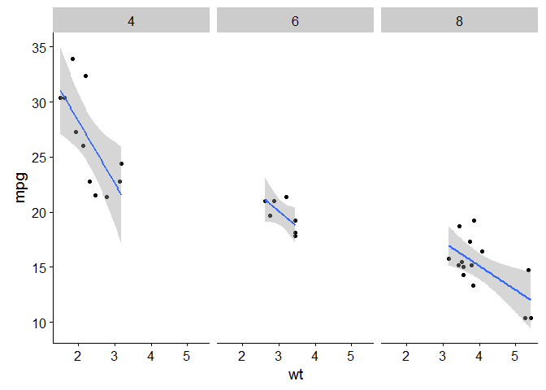

Plotting
========

Finally, we want to plot our data to summarise the model from the
previous step.
[ggplot2](https://cran.r-project.org/web/packages/ggplot2/ggplot2.pdf)
is designed to work with tidy data formats and is based on the idea of
the [grammar of
graphics](https://ramnathv.github.io/pycon2014-r/visualize/ggplot2.html).
This concept makes building up graphs from very simple to complex quite
straightforward by adding additional layers. However, ggplot2 does have
some less than ideal formatting like a grey gridded background. The
[cowplot]() package overrides some of these settings to make publication
quality plots. Cowplot also has some nice functionality for arranging
plots. The [R graphics cookbook](http://www.cookbook-r.com/Graphs/)
provides some helpful tutorials for building up plots using ggplot2.

The features that I find most useful in ggplot2 are:

-   Build up plots layer-by-layer
-   Can use `facet_wrap()` and `facet_grid()` to create separate plots
    by a factor in the dataframe

Lets make a plot of the `mtcars` model from the previous step:

    data(mtcars)
    library(ggplot2)

    ## Warning: package 'ggplot2' was built under R version 3.3.2

    library(cowplot)

    ## Warning: package 'cowplot' was built under R version 3.3.2

    ## 
    ## Attaching package: 'cowplot'

    ## The following object is masked from 'package:ggplot2':
    ## 
    ##     ggsave

    p <- ggplot(mtcars, aes(x = wt, y = mpg)) + 
      geom_point() + 
      geom_smooth(method = "lm")

    p

We can then use `facet_wrap()` to get a separate plot for each number of
cylinders:

    p <- p + facet_wrap(~cyl)

    p

The `aes()` part of the call to `ggplot()` allows us to set the
aesthetics of the plot, for example the `colour`, based on variables in
the dataframe.

> ### Worked example
>
> In a new code chunk in your R Notebook, use ggplot to make a plot of
> the linear model created in the previous step. Colour the points by
> species name.

**Next:** [Additional resources](./next_steps.md)
