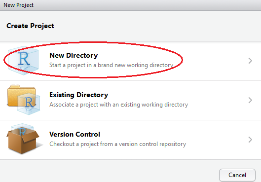
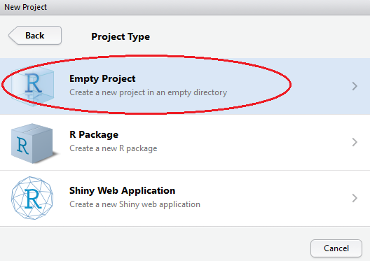
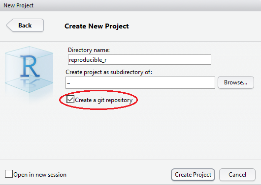
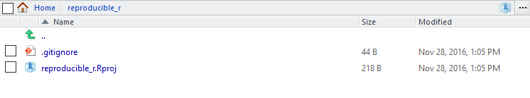

# Setting up an R project

A project is a folder that contains everything concerning your analysis and may include code, data and documentation. It is a complete research object that can be used to describe and reproduce your research.

Create a new project in RStudio as follows:

**File** -> **New Project** -> **New Directory**

In the **Project Type** screen, click on **Empty Project**.

In the **Create New Project** screen, give your project a name, set the folder to an appropriate location by clicking browse, and ensure that **create a git repository** is checked. Click on **Create Project**.

RStudio will create a new folder containing an empty project and set R's working directory to within it.

Two files are created in the otherwise empty project:-

* **.gitignore** - Specifies files that should be ignored by the version control ystem.
* **reproducible_r.Rproj** - Configuration information for the RStudio project

There is no need to worry about the contents of either of these for the purposes of this tutorial. Tamora will be covering how to use git for version control in one of the other breakout sessions.

**Next:** [Creating an RMarkdown notebook](./r_markdown.md)