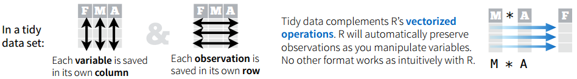

# Tidying Data

[“Tidy datasets are all alike but every messy datset is messy in its own way” (Hadley Wickham, 2014)](http://vita.had.co.nz/papers/tidy-data.html)

Key features of tidy data are:

- Observations in rows
- Variables in columns
- Each type of observational unit is a table



Messy data can take many forms. For example:

- Column headers are values, not variable names
- Multiple variables stored in one column
- Variables stored in both rows and columns
- Multiple observational unit types in the same table
- Single observational unit in multiple tables

Let's explore the data we loaded in the last exercise:
```{r, echo=FALSE}
iris <- read.csv("iris.csv")
```

```{r}
# get the structure of the dataframe
str(iris)

# head gives us the first 6 rows to explore 
head(iris)
```

Here we have three characteristics of messy data:

- Species names (which are values) as column headers
- Multiple variables stored in one column: sample number and measurement type as a compound variable
- Variables (the measurement types) are stored in rows instead of columns

The [tidyr](https://blog.rstudio.org/2014/07/22/introducing-tidyr/) package provides functions to fix many of the issues in messy datasets. 

- `gather()` takes multiple columns and gathers them into key-value pairs. We can use this to get the species names into rows.

- `separate()` takes one column and separates into multiple columns. We can use this to split the sample number from the measurement type. 

- `spread()` takes two columns (a key-value pair) and spreads them into multiple columns. We can use this to get the measurement types to form columns.

Two other useful packages for tidying data are [lubridate](https://cran.r-project.org/web/packages/lubridate/lubridate.pdf) for working with dates and [taxize](https://ropensci.org/tutorials/taxize_tutorial.html) for cleaning taxonomic information.

> ### Challenge
>
> In a new code chunk in your R Notebook, load the tidyr package using `library(tidyr)` and use the suggested functions to get the data into tidy data format. 
>
> **HINT** Use `?` to get help on how to use a function (e.g. `?separate`)

**Next:** [Manipulating and summarising data](./summarising_data.md)